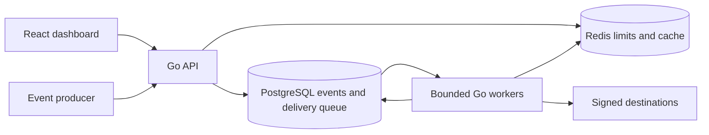

# PulseRoute

[](https://github.com/Yosshmi/pulseroute/actions/workflows/ci.yml)

A webhook delivery platform built with Go, PostgreSQL, Redis and React/TypeScript.
Accept events, deliver asynchronously, inspect attempts and replay dead letters.
Synthetic data only; no production usage or customer claims. Developed with AI
assistance, with evidence in executable tests, experiments and normal Git history.

## Why this project

A timeout can mean the receiver never saw a request—or committed a side effect
before its response was lost. PulseRoute handles retries and makes that ambiguity
visible without pretending HTTP delivery is exactly once.

## Features

- Registration, secure cookie sessions, owner-scoped projects and revocable API keys.
- Endpoint management, encrypted signing secrets and configurable retry/rate policies.
- Concurrent-safe idempotency; atomic event persistence and destination fan-out.
- Independent API and bounded worker processes, expiring leases and fenced completion.
- HMAC-SHA256, jittered retries, attempt history, dead letters and replay generations.
- React dashboard with filters, pagination, real metrics and loading/error/empty states.
- Configurable signed receiver, synthetic seeding and measured performance tooling.
- Unit, real-service integration and browser tests; Compose, CI and Kubernetes files.

## Run locally

Requirements: Docker Engine with Compose, Bash and OpenSSL (Git Bash on Windows).
Go and Node are not required for this path.

```bash
git clone https://github.com/Yosshmi/pulseroute.git
cd pulseroute
bash scripts/setup.sh
docker compose up --build -d --wait
bash scripts/seed.sh --events 30
```

Open **http://localhost:3000**. Seed prints a generated password for
`demo@pulseroute.test`; save it locally. Or register your own account. Seed creates
three destinations and six generic event types. To seed the same account again,
pass its password via `docker compose exec -e DEMO_PASSWORD="$DEMO_PASSWORD" api
/app/bin/seed --events 30`.

`docker compose down` stops the stack and retains PostgreSQL data; `-v` deletes that
data. Redis is intentionally ephemeral. API and dashboard also run at port 8080.
All exposed ports bind loopback. Compose allows private endpoints and HTTP cookies
for local demonstration; do not expose that configuration to the internet.

### Native development

Use Go 1.26+ (verified with 1.27.1), Node 24, PostgreSQL and Redis. After setup,
`docker compose up -d postgres redis`; export `.env` into each terminal, then:

```bash
bash scripts/migrate.sh
go run ./cmd/api       # terminal 1
go run ./cmd/worker    # terminal 2
go run ./cmd/receiver  # terminal 3: RECEIVER_SECRET required
cd frontend && npm ci && npm run dev  # terminal 4
```

Native workers reach the receiver at `http://localhost:8090`; Compose workers use
`http://receiver:8090`. Set the endpoint secret to the receiver's configured secret.
The receiver supports `?failures=2`, `?status=429`, `?status=400`, and `?sleep=15s`.
`cmd/demo` combines API/worker and applies migrations for limited free hosting.

## Architecture and stack



Standard-library net/http and slog, pgx, go-redis, bcrypt; PostgreSQL 18, Redis 7;
React 19, TypeScript, Vite, Vitest and Playwright. No external broker is needed.

### Delivery and reliability model

1. Authenticate a hashed API key; apply the Redis bucket and validate JSON.
2. Persist the event and active-endpoint delivery rows in one SQL transaction.
3. Return 202 after commit. Identical duplicate: 200. Same ID/different content: 409.
4. Workers reserve capacity before claiming due rows with `SKIP LOCKED` and leases.
5. Send signed HTTP requests with timeouts; atomically record attempts and outcomes.
6. Late workers cannot overwrite a newer lease owner's database result.

The guarantee is durable **at-least-once attempts with a finite retry budget**,
not guaranteed eventual success. Receivers must deduplicate side effects. A crash
after a receiver succeeds but before the worker records it can cause a duplicate.
Events are not ordered. Destination membership is selected on first acceptance.

Retry network failures, timeout, 408, 429 and 5xx. Default five attempts, five-second
exponential base, one-hour cap, jitter between half/full delay. Ordinary 4xx and
redirects are permanent. Retry-After is not parsed. Replay increments generation,
resets the attempt budget and retains history. Paused/deleted endpoints cancel
pending work when claimed; already running HTTP requests may finish.

Redis token buckets coordinate ingestion (50/s, burst 100 per key) and configurable
endpoint delivery rates. Redis outage returns 503 for ingestion/auth and defers
delivery. Five-second dashboard caches fall back to SQL on cache failure. Durable
idempotency uses PostgreSQL's `(project_id,event_id)` unique constraint, not Redis.

## API examples

Create a project, endpoint and API key in the dashboard; export the key locally.

```bash
curl -i http://localhost:8080/v1/events \
  -H "Authorization: Bearer $API_KEY" \
  -H 'Content-Type: application/json' \
  -d '{"event_id":"order-1001","type":"order.created","data":{"synthetic":true,"value":1499}}'
```

Resend it to observe idempotency. Change `data` under the same ID to observe 409.
The conversion scenario in the brief belongs inside `data`; the generic envelope
keeps `event_id` and `type` at the top level. Maximum request body: 1 MiB.

| API | Purpose |
|---|---|
| `POST /api/auth/register`, `/login`, `/logout`; `GET /api/auth/me` | Sessions |
| `GET/POST /api/projects`; `GET /api/projects/{id}` | Projects |
| `GET/POST /api/projects/{id}/endpoints`; `PATCH/DELETE /api/endpoints/{id}` | Destinations |
| `GET/POST /api/projects/{id}/api-keys`; `DELETE /api/api-keys/{id}` | Credentials |
| `POST /v1/events` | API-key ingestion |
| `GET /api/events`, `/api/events/{id}` | Events and payloads |
| `GET /api/deliveries`, `/api/deliveries/{id}` | Delivery history |
| `GET /api/dead-letters`; `POST /api/dead-letters/{id}/replay` | Dead letters |
| `POST /api/deliveries/{id}/replay` | Replay a dead delivery |
| `GET /api/dashboard`, `/health`, `/ready` | Metrics and health |

Management routes require a session cookie. Lists accept `limit` (1..100) and
`offset` (0..100000). Events/deliveries accept `project_id`, `type`, `since` (RFC3339);
deliveries also accept `status`, `endpoint_id`. PATCH supports partial fields.
Application errors contain `error.code`, `error.message`, `error.request_id`.
Responses include `X-Request-ID` for log correlation.

## Security

Bcrypt passwords; hashed random API/session tokens; HttpOnly/SameSite Strict cookies
with Secure enabled by default. All management queries scope project ownership.
AES-256-GCM encrypts endpoint secrets; keep the encryption key stable and backed up.
HTTPS destinations, dial-time DNS/IP checks, disabled redirects and no proxy-env
inheritance protect outbound requests. Private destinations require explicit local
opt-in. Cross-origin browser mutations are rejected. Logs exclude credential values,
payloads and response bodies. Production still needs an egress firewall and abuse controls.

Verify the exact raw body before JSON parsing:

```text
expected = HMAC-SHA256(secret, timestamp + "." + raw_body)
X-PulseRoute-Signature = "v1=" + hex(expected)
```

Reject timestamps outside ±5 minutes; compare decoded signatures with `hmac.Equal`.
Then deduplicate `X-PulseRoute-Event-ID` transactionally at the receiver. See working
code in `internal/security.Verify` and `internal/receiver`.

## Environment variables

| Variable | Default / requirement |
|---|---|
| `DATABASE_URL` | Required PostgreSQL connection string, TLS remotely |
| `REDIS_URL` | `redis://localhost:6379/0`, use `rediss://` remotely |
| `ENCRYPTION_KEY` | Required 32 random bytes as 64 hex characters |
| `PORT`, `WORKER_PORT` | `8080`, `8081` |
| `WORKERS`, `POLL_INTERVAL` | `5` (1..128), `500ms` |
| `HTTP_TIMEOUT`, `LEASE_DURATION` | `10s`, `60s`; lease ≥3× timeout |
| `COOKIE_SECURE`, `ALLOW_PRIVATE_ENDPOINTS` | `true`, `false` |
| `STATIC_DIR` | `frontend/dist` |
| `RECEIVER_SECRET` | Receiver/seed secret, ≥16 bytes |
| `POSTGRES_PASSWORD` | Compose only, generated by setup |
| `DEMO_PASSWORD`, `API_KEY` | Optional seed password / required load-test key |
| `TEST_DATABASE_URL`, `TEST_REDIS_URL` | Dedicated integration services |
| `RUN_PERFORMANCE` | `1` enables measured worker comparison |

## Database, tests and performance

Tables: users, sessions, projects, api_keys, endpoints, events, deliveries,
delivery_attempts, dead_letters. Foreign keys preserve relationships; unique keys
protect idempotency; partial indexes serve due/expired jobs. Embedded migrations
run transactionally under an advisory lock. See [architecture](docs/architecture.md).

```bash
go test ./cmd/... ./internal/... ./migrations/... ./tests/...
# Integration explicitly skips without TEST_DATABASE_URL; use dedicated test services:
export TEST_DATABASE_URL='postgres://.../pulseroute_test?sslmode=disable'
export TEST_REDIS_URL='redis://localhost:6379/15'
bash scripts/test.sh
# E2E needs API port 8080 and receiver with secret browser-receiver-secret:
cd frontend && npx playwright install chromium && npm run test:e2e
```

CI performs formatting, vet, race tests with PostgreSQL/Redis, frontend lint/tests/
build, all-command builds, Docker builds, Compose health/seed checks and browser E2E.
Windows race detection requires a C compiler; Linux CI supplies one. Never use a
real data environment for tests. [Verification report](docs/verification.md).

`API_KEY=... bash scripts/load-test.sh --events 100 --concurrency 5` measures HTTP
throughput, error rate and P50/P95. `RUN_PERFORMANCE=1 go test -run TestPerformance
-v ./tests` measures delivery throughput at 1/5/10/25 workers. These small local
bursts are not production capacity claims. [Measured results](docs/performance.md).
Run `psql "$TEST_DATABASE_URL" -f scripts/explain.sql` for a rollback-only index
experiment; [actual captured plans](docs/query-plans.txt) are included.

## Deployment and study material

- [Free deployment](docs/deployment.md): Render combined demo, Neon and Upstash.
  Provider accounts required; no verified public application URL claimed.
- [Kubernetes](deployments/kubernetes/README.md): manifests provided, not a live
  production deployment. API/worker deployments, services, probes, limits, ConfigMap,
  external Secret reference and migration Job.
- [Architecture](docs/architecture.md) and [eight ADRs](docs/decisions/).
- [INTERVIEW_HANDBOOK.md](docs/INTERVIEW_HANDBOOK.md): teaching guide and 50+ questions.
- [CODE_WALKTHROUGH.md](docs/CODE_WALKTHROUGH.md): study order and function index.
- [RESUME_NOTES.md](docs/RESUME_NOTES.md): demonstrable claims and follow-up questions.

```text
cmd/                 API, worker, demo, receiver, migrations, seed, load test
internal/api/        auth, ownership, ingestion, inspection and dashboard
internal/delivery/   queue claims, attempts, retry policy and worker pool
internal/security/   hashing, encryption, signatures and safe HTTP transport
internal/redisx/     token buckets and short-lived cache
migrations/          embedded SQL and runner
frontend/            React dashboard, unit and Playwright tests
tests/               integration and measured worker experiment
scripts/             setup, migrate, seed, test, load and query plans
deployments/         Docker and Kubernetes
docs/                decisions, teaching material and verification
```

## Trade-offs and next steps

Single-owner projects; no teams, password reset or email verification. No retention
job, key-rotation workflow, ordering guarantee, circuit breaker or production SLOs.
Socket-IP auth throttling is shared behind a proxy until a trusted-proxy policy is
added. Endpoint settings load at claim time. Offset pagination and live aggregates
need replacement when history becomes large. Expired sessions/old attempts require
an operational retention policy. Receiver failure counters are bounded in-memory
demo state. Public registration needs additional abuse controls before production.

Next steps should follow evidence: keyset pagination, rollups, queue-age alerts,
retention/partitioning and destination fairness; add an outbox/broker only after
measuring PostgreSQL contention. No fake scale, users, benchmarks or deployment.
