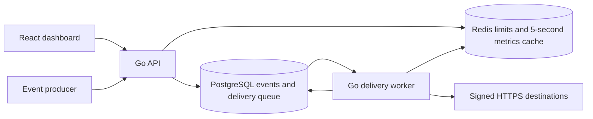
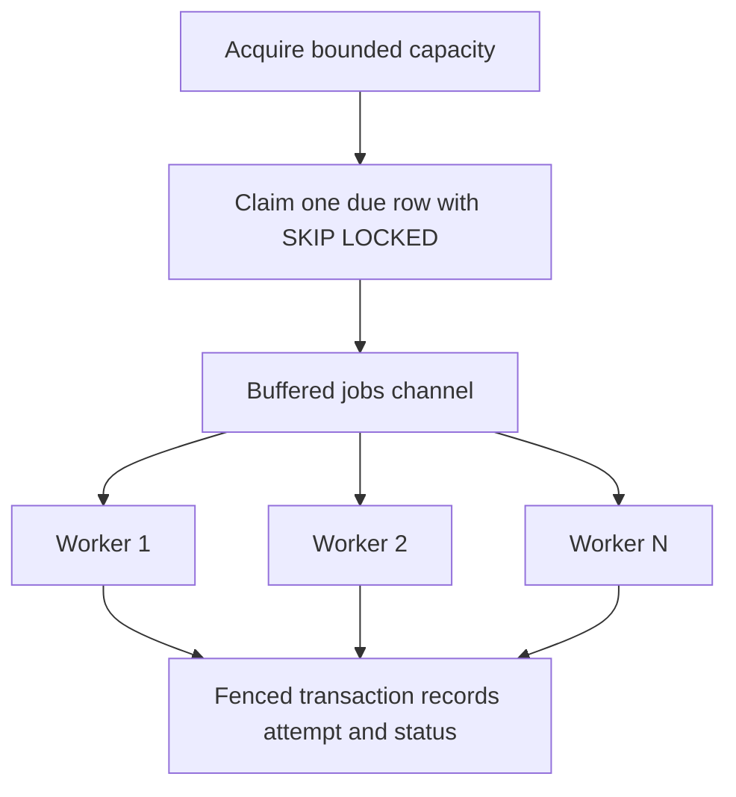
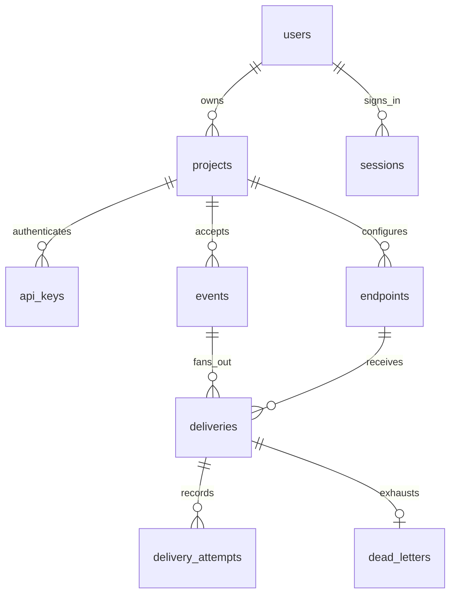

# Architecture and reliability

PulseRoute has two independently runnable service boundaries: an HTTP control and
ingestion API, and an outbound delivery worker. They share a schema and Go packages.
This is a small service-oriented system, not independently owned databases per
microservice. A combined command exists only to fit a free public demo host.



## Ingestion and atomic fan-out

```mermaid
sequenceDiagram
  participant C as Producer
  participant A as API
  participant R as Redis
  participant P as PostgreSQL
  C->>A: POST /v1/events + API key
  A->>P: Look up SHA-256 key hash; reject revoked key
  A->>R: Atomic token bucket
  A->>A: Validate and canonicalize envelope
  A->>P: BEGIN
  A->>P: INSERT event ON CONFLICT DO NOTHING
  alt New event
    A->>P: INSERT deliveries SELECT active endpoints
    A->>P: COMMIT
    A-->>C: 202 accepted
  else Duplicate
    A->>P: Read existing content hash
    A-->>C: 200 duplicate or 409 changed content
  end
```

The `(project_id,event_id)` unique constraint arbitrates concurrent writers.
At READ COMMITTED, an insert waiting on a conflicting transaction sees its outcome;
the following SELECT receives a new statement snapshot. Identical requests reuse
the event; mismatched content returns 409. JSON object keys and whitespace are
normalized, numbers retain their lexical precision. Numeric spellings such as
`1` and `1.0` may conflict by design. Do not use duplicate ingestion to target a new
endpoint: destinations are selected once at initial acceptance. Zero active
endpoints is valid and creates an event without deliveries.

The `deliveries` table is the queue. There is no separate enqueue call after commit,
so a crash cannot leave an accepted event without the jobs in that transaction.
No Redis idempotency cache is used: avoiding a stale negative cache is simpler.

## Worker, leases, retries



Implementation acquires a capacity slot **before** claiming. At most N jobs are
claimed or active per process. N goroutines drain a buffered channel. PostgreSQL
retains the rest of the backlog. A lease defaults to 60s, and configuration requires
at least three times the 10s HTTP timeout. Completion takes a row lock and checks
the unique lease token. A replacement owner gets a different token; stale results
cannot overwrite it. There is no heartbeat renewal because requests have a fixed
short timeout. An unexpectedly long DB pause can still allow duplicate HTTP sends.

```mermaid
sequenceDiagram
  participant W as Worker
  participant P as PostgreSQL
  participant D as Destination
  W->>P: Claim due row, set lease + token
  W->>W: Check active endpoint and Redis rate bucket
  W->>D: POST exact JSON bytes + timestamp HMAC
  D-->>W: HTTP status or timeout
  W->>P: Lock row and verify lease token
  W->>P: Insert attempt; update terminal/retry state
  alt Retryable and budget remains
    W->>P: Set next_attempt_at with exponential jitter
  else Permanent or exhausted
    W->>P: Insert dead letter
  end
```

States: pending → processing → succeeded, retrying, dead, or cancelled. Retryable
outcomes are network failure, timeout, HTTP 408, 429 and 5xx. Redirects are not
followed and ordinary 4xx is permanent. Equal jitter draws from half to all of
`min(base_delay * 2^(attempt-1),1 hour)`; max attempts defaults to 5 and is 1..10.
The first attempt is immediate. Retry-After is not currently honored; document this
when discussing rate-limit behavior. Redis throttling reschedules without using an
HTTP attempt. Paused/deleted destinations cancel pending work when claimed; an
already running request may still finish. Reactivating does not restore cancelled
deliveries. Replay accepts only dead deliveries to active endpoints, increments
generation, resets the attempt budget, and preserves all prior attempts.

## Delivery guarantee and failure boundaries

The system schedules at-least-once delivery attempts with a finite retry budget.
It cannot promise eventual success against a permanently unavailable destination.
If a receiver commits a side effect and the worker crashes before recording success,
the lease expires and the HTTP request is sent again. Receivers must deduplicate on
project/source plus external event ID, using their own transactional unique key.
HMAC proves integrity and authenticity, not exactly-once effects. Timestamp checks
limit replay windows but do not eliminate replay within that window.

SIGTERM cancels claims and HTTP requests, the producer closes the jobs channel, a
WaitGroup joins all workers, and pools close last. Cancelled in-flight attempts are
not recorded as failures during shutdown; their leases recover after restart.
Database failures stop acceptance or leave leases recoverable. Redis failure
rejects ingestion/authentication with 503 and delays delivery; existing durable
data remains safe. Cache read/write failures fall back to SQL. Logging never
includes payloads, key material, passwords, cookies, or destination response bodies.

## Schema and query choices



The schema uses foreign keys, CHECK constraints and project/time indexes.
`deliveries_due` and `deliveries_expired` are partial indexes for runnable work and
crash recovery. `events_type_time` supports type filtering in recent-event views.
Lists use deterministic time/ID ordering and bounded offset pagination (25 default,
100 maximum). Deep offsets and dashboard aggregates will become expensive at large
history sizes. Keyset pagination, retention, and rollups are deliberate next steps.
See the reproducible [query-plan experiment](../scripts/explain.sql).

## Security and operational limits

Passwords use bcrypt; opaque session and API tokens are random and stored as hashes.
Sessions expire after 24 hours, are revocable on logout and use HttpOnly, SameSite
Strict cookies, Secure by default. All management queries scope ownership in SQL.
No teams, invitations, password reset or email verification are implemented.
Mutation requests reject cross-origin browser origins and cross-site fetches.
API-key requests do not rely on cookies. Rate limiting auth by socket IP avoids
trusting spoofable forwarding headers; behind a reverse proxy this is shared and
requires a trusted-proxy policy before production traffic.

Endpoint secrets are AES-256-GCM encrypted with random nonces and associated data.
There is no in-app key rotation mechanism yet. Keep the encryption key stable and
backed up outside the database. Secrets are shown once at creation. HTTPS is
required except explicitly enabled local demo mode. DNS is resolved and every
result validated at connect time; the client dials the checked address and rejects
private/special networks, proxy environment variables and redirects. A production
egress firewall is still appropriate defense in depth. Local Compose deliberately
allows private endpoints and binds host ports to loopback; never expose that
configuration directly to the internet.

Redis uses atomic Lua token buckets: ingestion 50/s with burst 100 per key; endpoint
delivery uses its configured rate as burst capacity. Buckets expire after their
refill duration plus 60s. Redis's own clock prevents replica clock skew. Dashboard
caches include owner/project IDs and expire after five seconds. TTL invalidation
is intentional; writes need not synchronously delete these approximate views.
Redis loss resets buckets and can permit a fresh burst when it returns.
